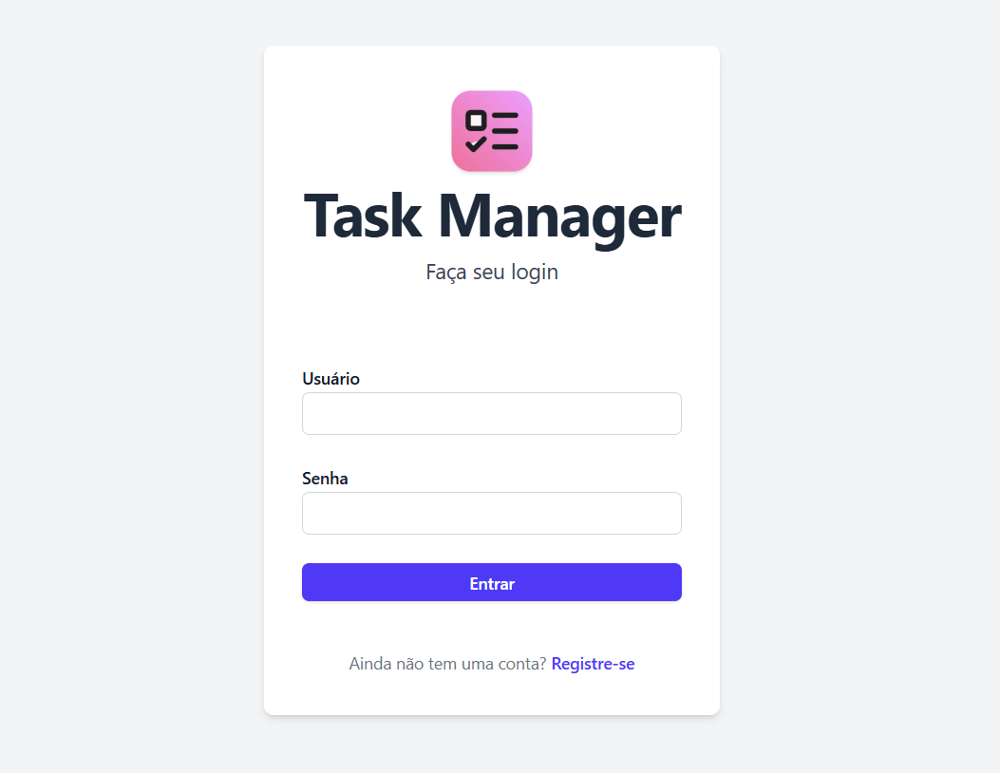

# Task Manager - Aplicação para Controle de Tarefas



## Descrição do Projeto

Este projeto consiste em uma aplicação web fullstack para gerenciamento de tarefas. Os usuários podem criar, visualizar, editar e excluir tarefas, utilizando autenticação baseada em JWT. A aplicação é composta por um front-end em React, um back-end em Node.js com Express e um banco de dados MongoDB gerenciado via Mongoose.

## Tecnologias Utilizadas

- **Front-end:** React + TypeScript
- **Back-end:** Node.js + Express + TypeScript
- **Banco de Dados:** MongoDB
- **ODM:** Mongoose
- **Autenticação:** JWT
- **Docker:** Docker Compose para ambiente de desenvolvimento
- **Testes:** Jest + Supertest para a API

## Estrutura do Projeto

```
/project-root
│── /client      # Front-end React
│── /server      # Back-end Express
│── docker-compose.yml
│── README.md
```

## Como Rodar o Projeto

### Executando Manualmente

#### 1. Banco de Dados

Caso não utilize o Docker, é necessário rodar um servidor MongoDB localmente.

#### 2. Back-end (API Express)

```sh
cd server
npm install
npm run start
```

A API ficará acessível em `http://localhost:3000`

#### 3. Front-end (React)

```sh
cd client
npm install
npm run dev
```

A aplicação React ficará acessível em `http://localhost:8080`

### Executando com Docker Compose

A aplicação pode ser inicializada completamente usando o Docker Compose, para isso é necessário instalar as dependências do frontend inicialmente.

```sh
cd client
npm install
```

```sh
docker-compose up --build
```

Isso iniciará os seguintes serviços:
- Front-end React em `http://localhost:8080`
- API Express em `http://localhost:3000`
- Banco de dados MongoDB


## Executando Testes

Os testes estão configurados para a API e podem ser executados com:

```sh
cd server
npm run test
```
